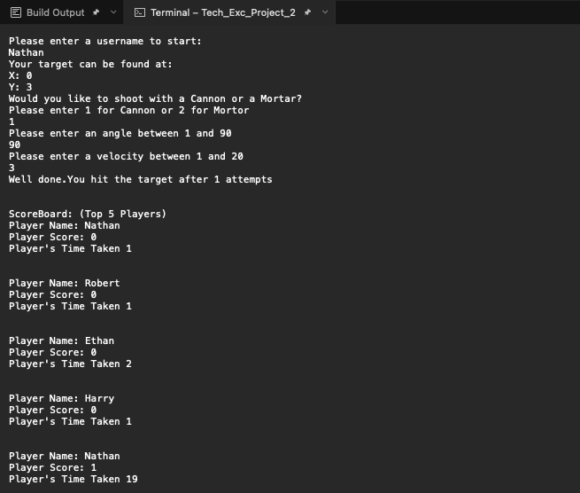

# CannonGame

A simple game comprising of a 10 x 10 grid containing a randomly generated target, where the user is tasked with hitting the target by entering a velocity and an angle to aim the shot. 

## Overview
- A user is asked to enter a username
- A user is presented with a target comprising of x, y coordinates between 1 and 10
- The user is asked to choose which shot type they would like to use: Cannon or Mortar
- The user is asked to enter a velocity and angle to aim and fire the shot
- If the user hits the target, the game ends and it tells the user how many shots it took
- If the user doesn't hit the target, the user is asked to take another shot
- Once the game ends, the top 5 players alongside their scores and timestamps are printed out

#### Cannon Shot
- The user is able to enter an angle between 1 - 90 and a velocity between 1 - 20
- If the cannon shot hits at (7, 7) and the target is at (7, 7), then this is a hit
- If the cannon shot hits at (6, 7) and the target is at (7, 7), then this is a miss

#### Mortar Shot
- This shot doesn't need to be so accurate. If the location is within 1 of the actual position, then it is considered to be a hit, e.g, 
target at (7, 7) and shot lands at (6, 7) then this is a hit
- However, the angle can only be provided in increments of 5

## Showcase

## Motivation Behind Project
- The project was developed during my time as an Associate Developer at Apexon (1 year placement). It was developed as part of a training exercise to practice Test-Driven Development and SOLID principles
- Both Test-Driven Development and SOLID principles are common practices which are heavily utilised in the workplace. As such, they are essential to learn and practice
